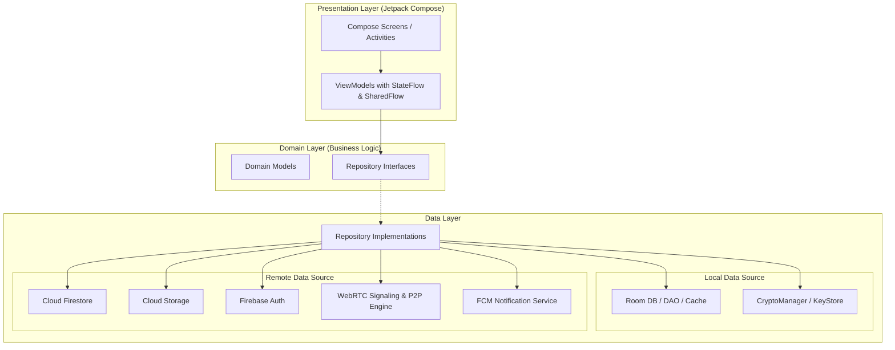

# 📱 Misal — E2EE Real-Time Messaging & WebRTC Calling Platform

<div align="center">

[](https://developer.android.com/)
[](https://kotlinlang.org/)
[](https://developer.android.com/jetpack/compose)
[](https://webrtc.org/)
[](https://firebase.google.com/)
[]()
[-darkgreen?style=for-the-badge)]()

<p align="center">
  <strong>Misal</strong> is a production-grade, secure, and privacy-first instant messaging and VoIP calling Android application built entirely with <strong>Modern Android Development (MAD)</strong> practices.
</p>

[Key Features](#-key-features) •
[Architecture](#-architecture) •
[Security & Cryptography](#-security--cryptography) •
[Tech Stack](#-tech-stack) •
[Getting Started](#-getting-started) •
[Screenshots](#-screenshots)

</div>

---

## 🌟 Key Features

### 🎙️ Peer-to-Peer Voice & Video Calling (WebRTC)
- **Low-Latency Communication**: Real-time 1:1 voice and video calling powered by **Stream WebRTC Android SDK**.
- **Robust Signaling**: Firestore-backed SDP (Session Description Protocol) offer/answer exchange and ICE candidate trickle synchronization.
- **VoIP Call Experience**: High-priority Firebase Cloud Messaging (FCM) data push triggers **Foreground Services (`shortService`)** and full-screen incoming call intents even when the application is killed or in background.

### 🔐 Hardware-Backed End-to-End Encryption (E2EE)
- **Android KeyStore Integration**: Cryptographic keys are generated and stored securely in the hardware-backed keystore (`AndroidKeyStore`).
- **Hybrid Encryption**: Combines **RSA-OAEP (2048-bit)** for secure asymmetric session key exchange with **AES-GCM (256-bit)** for message and media payload encryption.
- **Multi-Recipient Group Encryption**: Scalable group messaging where AES payload keys are encrypted individually per member using their public RSA keys.

### 💬 Rich Instant Messaging & Collaboration
- **Real-Time Synchronization**: Instant message delivery using Firebase Cloud Firestore snapshot listeners.
- **Offline-First Persistence**: Powered by **Room Database** for seamless offline message caching, local search, and background synchronization upon network recovery.
- **Media & File Sharing**: Encrypted images, voice notes, and location sharing via Firebase Cloud Storage and Google Play Services Location API.
- **Interactive Messaging**: Real-time emoji reactions, message reply threads, read receipts, and in-chat interactive polls.
- **Ephemeral (Disappearing) Messages**: Configurable expiration timers for automatic client and server-side message eviction.

### 👥 Contacts & Community
- **Group Management**: Create and configure custom groups, member permissions, group profiles, and group avatars.
- **Contact Sync & Status**: Real-time user discovery, profile customization, and live online/last-seen presence status.

---

## 📐 Architecture

Misal adheres to the official **Android Architecture Guidelines**, adopting **Clean Architecture** combined with the **MVVM (Model-View-ViewModel)** and **Repository Pattern**.



### Architectural Highlights
- **Unidirectional Data Flow (UDF)**: ViewModels emit immutable `StateFlow` states collected by Compose UI with lifecycle awareness (`collectAsStateWithLifecycle`).
- **Single Source of Truth (SSOT)**: Local Room database acts as the single source of truth for message feeds, providing zero-latency UI rendering and full offline capability.
- **Dependency Injection**: Fully decoupled dependencies managed via **Dagger Hilt** (`@AndroidEntryPoint`, `@HiltViewModel`, modular `@Module` providers).

---

## 🔒 Security & Cryptography

All sensitive data in Misal is protected with industry-standard cryptographic primitives encapsulated within [`CryptoManager.kt`](file:///app/src/main/java/com/example/misal/security/CryptoManager.kt):

| Component | Specification | Purpose |
| :--- | :--- | :--- |
| **Key Storage** | `AndroidKeyStore` (Hardware-backed / StrongBox when available) | Non-exportable private key protection |
| **Asymmetric Cipher** | `RSA/ECB/OAEPWithSHA-256AndMGF1Padding` | Secure exchange of symmetric session keys |
| **Symmetric Cipher** | `AES/GCM/NoPadding` (256-bit keys, 128-bit authentication tag) | High-speed, authenticated payload encryption |
| **Integrity & Nonce** | 12-byte cryptographically secure random Initialization Vector (IV) | Replay-attack prevention & ciphertext freshness |

```
[Sender]                                                        [Recipient]
   │                                                                 │
   ├─► Generate 256-bit AES Session Key                              │
   ├─► Encrypt Plaintext with AES-GCM (Payload + IV)                │
   ├─► Encrypt AES Key with Recipient's RSA Public Key               │
   ├─► Upload Encrypted Package to Firestore                         │
   │                                   ───────────────►              │
   │                                                    Receive Encrypted Package
   │                                                                 ├─► Decrypt AES Key using Private RSA in KeyStore
   │                                                                 └─► Decrypt Payload using AES-GCM with IV
```

---

## 🛠️ Tech Stack

- **Core & Runtime**:
  - [Kotlin](https://kotlinlang.org/) — 100% Kotlin codebase
  - [Kotlin Coroutines & Flow](https://kotlinlang.org/docs/coroutines-overview.html) — Asynchronous reactive streams
- **UI & Design**:
  - [Jetpack Compose](https://developer.android.com/jetpack/compose) — Declarative UI toolkit
  - [Material Design 3 (M3)](https://m3.material.io/) — Modern theming, dynamic colors, and smooth animations
  - [Coil](https://coil-kt.github.io/coil/) — Asynchronous image loading and disk caching
- **Architecture & DI**:
  - [Android Jetpack (ViewModel, Lifecycle, Navigation)](https://developer.android.com/jetpack)
  - [Dagger Hilt](https://dagger.dev/hilt/) — Dependency injection framework
- **Local Persistence**:
  - [Room Database](https://developer.android.com/training/data-storage/room) — SQLite abstraction layer with reactive Flow queries
- **VoIP & Real-Time Media**:
  - [Stream WebRTC Android](https://github.com/getstream/stream-webrtc-android) — WebRTC protocol implementation
- **Backend & Cloud Infrastructure**:
  - [Firebase Authentication](https://firebase.google.com/docs/auth) — Identity and session management
  - [Cloud Firestore](https://firebase.google.com/docs/firestore) — Real-time NoSQL signaling and message store
  - [Cloud Storage for Firebase](https://firebase.google.com/docs/storage) — Encrypted media blobs
  - [Firebase Cloud Messaging (FCM)](https://firebase.google.com/docs/cloud-messaging) — Push notifications & VoIP wake-up signals
  - [Firebase Cloud Functions](https://firebase.google.com/docs/functions) — Node.js serverless triggers for notifications and message lifecycle
- **Location Services**:
  - [Google Play Services Location](https://developers.google.com/android/reference/com/google/android/gms/location/package-summary) — Real-time geo-coordinates sharing

---

## 📂 Project Structure

```
com.example.misal
├── data
│   ├── dto                 # Firestore & network transfer objects
│   ├── local               # Room database, DAOs, and entities
│   │   ├── dao             # ChatDao, MessageDao, CallDao
│   │   └── entity          # Room database table entities
│   └── repository          # Concrete repository implementations (Firebase, Room, WebRTC)
├── di                      # Hilt dependency injection modules (DatabaseModule, FirebaseModule)
├── domain
│   ├── model               # Pure Kotlin business models (User, Chat, Message, Call)
│   └── repository          # Repository interfaces (Clean Architecture contracts)
├── fcm                     # Firebase Cloud Messaging & IncomingCallService
├── model                   # Shared data structures and UI models
├── security                # CryptoManager: KeyStore, RSA-OAEP, AES-GCM encryption
└── ui
    ├── screens             # Jetpack Compose UI screens (Chat, Calls, Profile, Contacts)
    ├── theme               # Material 3 Color Schemes, Typography, Shapes
    ├── utils               # Formatters, permission handlers, sound managers
    └── viewmodel           # AAC ViewModels managing screen states
```

---

## 🚀 Getting Started

### Prerequisites
- **Android Studio**: Android Studio Ladybug (2024.2.1+) or newer
- **JDK**: Version 17 or higher
- **Android SDK**: Min SDK 24 / Target SDK 35
- **Firebase Account**: Free Spark or Blaze plan

### Installation & Setup

1. **Clone the repository**:
   ```bash
   git clone https://github.com/YOUR_USERNAME/Misal.git
   cd Misal
   ```

2. **Configure Firebase**:
   - Create a project on the [Firebase Console](https://console.firebase.google.com/).
   - Add an Android App with package name `com.kisisel.misal`.
   - Download `google-services.json` and place it in the `app/` directory:
     ```bash
     cp app/google-services.json.example app/google-services.json
     # Replace with your actual Firebase configuration
     ```
   - Enable the following Firebase services:
     - **Authentication** (Email/Password)
     - **Cloud Firestore**
     - **Cloud Storage**
     - **Cloud Messaging**

3. **Deploy Security Rules & Cloud Functions**:
   ```bash
   firebase login
   firebase use --add your-project-id
   firebase deploy --only firestore:rules,functions
   ```

4. **Build & Run**:
   - Open the project in Android Studio.
   - Sync project with Gradle files.
   - Select a physical device or emulator (Android 7.0+) and press **Run (Shift + F10)**.

---

## 📸 Screenshots

| Chat Feed | Real-Time Chat | WebRTC Video Call | Audio Calling |
|:---------:|:--------------:|:-----------------:|:-------------:|
| *(Add Screenshot)* | *(Add Screenshot)* | *(Add Screenshot)* | *(Add Screenshot)* |

---

## 📄 License

This project is licensed under the [MIT License](LICENSE) - see the LICENSE file for details.

---

## 👨‍💻 Author

**Your Name**
- LinkedIn: [linkedin.com/in/furkan-çalık](https://linkedin.com/in/furkan-çalık)
- GitHub: [@furkankisisel](https://github.com/furkankisisel)
- Email: furkancalk325@gmail.com
